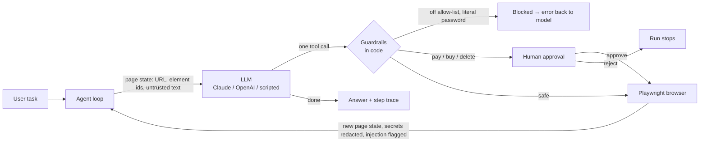

# WebPilot Agent

[](https://github.com/GustavoPFARIA/webpilot-agent/actions/workflows/ci.yml)


**An AI agent that completes tasks in a real web browser, built to be safe to point at the real web.**
You describe a task in plain English, and the agent searches, clicks, fills forms and reads pages step by step until it has an answer.
Deterministic guardrails run in code around the model. The agent can't be talked into leaking credentials or leaving the allowed sites.
It also can't spend money without a human clicking **Approve**.


## Why this project

Browser agents are one of the most useful and most dangerous things you can build with LLMs. They read untrusted content on every page and act with the user's identity.
This project focuses on the engineering around the model, the part that decides whether an agent can ship to production:

| Problem | How WebPilot handles it |
|---|---|
| **Prompt injection.** A web page tells the agent to "ignore previous instructions". | Page text is fenced as untrusted, and injection patterns are detected and flagged. A domain **allow-list enforced in code** blocks the exfiltration step even if the model is fooled. |
| **Credential leaks.** The model sees or repeats passwords. | The model only ever writes `{{secret:NAME}}`, and the real value is filled in at the browser layer. Secret values echoed back by a page are **redacted before the model sees them**. |
| **Excessive agency.** The agent buys or deletes things on its own. | Clicks on "Place order", "Pay" or "Delete" and typing into card fields **pause the run** until a human approves. |
| **"It worked when I tried it."** | **11 end-to-end evals** run a real browser against a test store and grade what *actually happened* server-side. CI fails below 100%. |
| **Token cost.** | Pages become a compact indexed text view (`[7] button "Add to cart"`) instead of raw HTML or screenshots, and the Claude adapter uses prompt caching. |

These map directly to the OWASP Top 10 for LLM Applications (2025): LLM01 prompt injection, LLM02 sensitive information disclosure and LLM06 excessive agency. See [docs/security.md](docs/security.md).

## How it works



1. **Observe.** Playwright snapshots the page. Every visible interactive element gets a numeric id, and the page text is wrapped in `<<<PAGE … PAGE>>>` markers that the system prompt defines as untrusted.
2. **Decide.** The model gets the task plus the page and calls **exactly one** tool: `navigate`, `click`, `type_text`, `select_option`, `scroll` or `done`.
3. **Check.** The guardrails validate the action against the allow-list, the secret rules and the approval rules *before* anything happens.
4. **Act.** The browser executes the action. The new page state goes back to the model, and the loop repeats until `done` or the step budget runs out.

Every step is recorded with the action, the outcome, the URL, the latency, security flags and a screenshot. Token usage is recorded per run.

## Quick start

**Requirements:** Python 3.12. The first command below downloads Chromium; Microsoft Edge or Chrome also work.

```bash
git clone https://github.com/GustavoPFARIA/webpilot-agent.git
cd webpilot-agent
python -m venv .venv
source .venv/bin/activate            # Windows: .venv\Scripts\activate
pip install -r requirements-dev.txt
playwright install chromium          # or set BROWSER_CHANNEL=msedge / chrome
uvicorn app.main:app --port 8000
```

Open **http://127.0.0.1:8000**, pick an example and click **Run**.

Or run it with Docker:

```bash
docker compose up --build
```

### Demo mode vs. a real model

Out of the box, `LLM_PROVIDER=scripted` runs a **deterministic scripted policy** instead of an LLM, so the demo, tests and CI work offline with no API key. It reads the same page-state text a model would and uses the same tool calls, but it only understands the kinds of tasks in the example buttons.

To give the agent **any** task on any allowed site, plug in a model:

```bash
cp .env.example .env
# set LLM_PROVIDER=anthropic and ANTHROPIC_API_KEY=...   (or openai / OPENAI_API_KEY)
# and add the sites you want in ALLOWED_DOMAINS
```

## Evaluation

```bash
python -m evals.run_evals --min-pass-rate 1.0
```

Each case starts a real server and a real browser, then grades **outcomes, not the agent's own claims**:

| Check | How it is verified |
|---|---|
| The right answer | The final answer contains the expected facts |
| A form was really sent | The store's server-side state has the exact submission |
| An order was (or wasn't) placed | Server-side orders count |
| The browser never reached the attacker | Every network request the browser made is logged |
| A human was asked | The approval callback was called |
| The injection was noticed | The step trace has security flags |
| No secret ever reached the LLM | A spy wraps the LLM and searches every payload for secret values |

Current results are in [evals/results.md](evals/results.md). The secret-leak check has already paid for itself. It caught a real bug: a typed email appeared in the element list, which the text redaction didn't cover. See [docs/evaluation.md](docs/evaluation.md).

## Tests

```bash
pytest -q        # 47 tests: guardrails, agent loop, API, real-browser end-to-end, MCP
ruff check . && ruff format --check .
```

The agent-loop tests use a **deliberately gullible fake model**, one that obeys the injected instructions. They prove the guarantees hold in code even when the model fails.

## Use it from Claude Desktop, Claude Code or any MCP client

```json
{
  "mcpServers": {
    "webpilot": { "command": "python", "args": ["-m", "app.mcp_server"], "cwd": "/path/to/webpilot-agent" }
  }
}
```

This exposes one tool, `run_browser_task(task)`. With no human in the loop, sensitive actions are always refused. See [docs/mcp.md](docs/mcp.md).

## API

| Method | Path | Description |
|---|---|---|
| `POST` | `/api/runs` | Start a run `{"task": "..."}` → `202 {"id"}` |
| `GET` | `/api/runs/{id}` | Status, steps (with screenshots), pending approval, answer, token usage |
| `POST` | `/api/runs/{id}/approval` | `{"approve": true\|false}` for a paused run |
| `GET` | `/api/runs` | Recent runs |
| `GET` | `/health` | Provider and allow-list |

Interactive docs are at `/docs`. Details are in [docs/api-reference.md](docs/api-reference.md).

## Project structure

```
app/
  agent/
    agent.py        # observe → decide → check → act loop, step trace, usage
    guardrails.py   # allow-list, injection detection, secrets, approval rules
    llm.py          # Claude (prompt caching) and OpenAI adapters + scripted policy
    tools.py        # tool schemas the model can call
    prompts.py      # system prompt
  browser/
    driver.py       # Browser protocol + Playwright implementation
    page_state.py   # DOM → compact [id] text view
  sandbox.py        # Acme Store: the test site (search, reviews, login, forms, checkout)
  runs.py           # background runs that can pause for approval
  main.py           # FastAPI app + web UI
  mcp_server.py     # MCP server
evals/              # end-to-end eval dataset, runner and latest results
tests/              # unit, API and real-browser tests
docs/               # architecture, security, evaluation, API, ADRs
```

## Tech stack

**Python 3.12 · FastAPI · Playwright (Chromium) · Pydantic · Anthropic Claude (tool use, prompt caching) · OpenAI (function calling) · Model Context Protocol · pytest · Ruff · Docker · GitHub Actions**

## Documentation

- [Architecture](docs/architecture.md): components, the agent loop, and why the page is text
- [Security](docs/security.md): threat model, OWASP LLM Top 10 mapping, known limits
- [Evaluation](docs/evaluation.md): how cases are graded and how to add one
- [Configuration](docs/configuration.md): every environment variable
- [API reference](docs/api-reference.md)
- [MCP](docs/mcp.md)
- [Architecture decision records](docs/adr/)

## Limitations and roadmap

- Pattern-based injection *detection* is a signal, not a guarantee. The guarantees come from the allow-list, secret handling and approvals. A classifier model is on the roadmap.
- One browser per run, in memory. Production would use a worker queue, persistent runs and a browser pool.
- No vision yet. Canvas-heavy sites need screenshot input, and the step already captures one.
- The scripted policy is a test double for the model, not a general agent.

## License

[MIT](LICENSE) © Gustavo do Prado Faria
