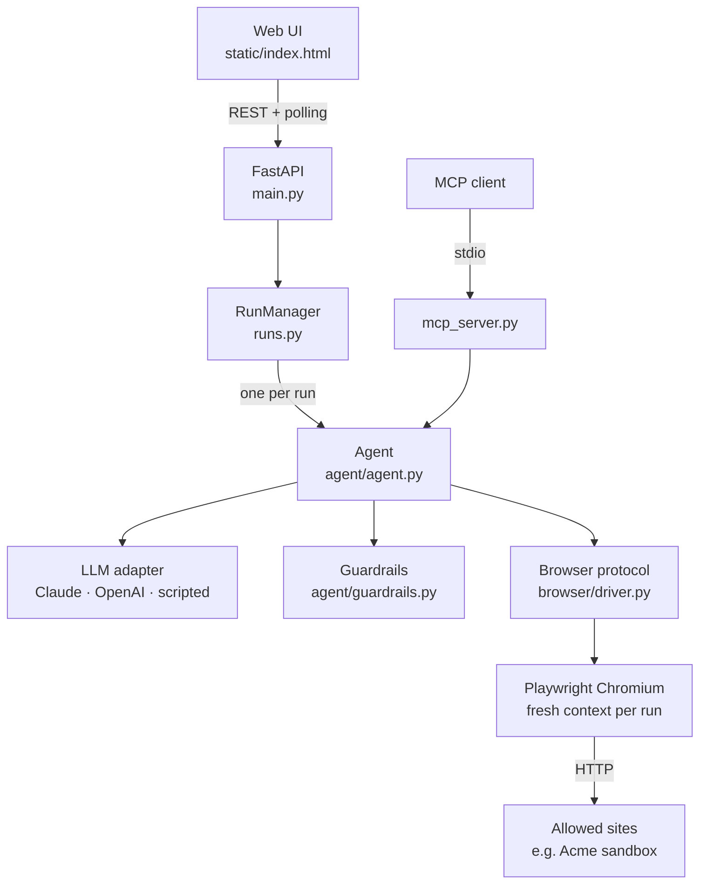

# Architecture

## Components



| Module | Responsibility |
|---|---|
| `agent/agent.py` | The loop. It owns the conversation with the model, runs each action through the guardrails, records a `Step` per action and totals token usage. |
| `agent/guardrails.py` | Pure functions with no I/O: `check_url`, `detect_injection`, `approval_reason`, `check_typing`, `resolve_secrets`, `redact`. They are easy to test and easy to audit. |
| `agent/llm.py` | One `LLM` protocol with three implementations. Messages are kept in one internal format (Anthropic content blocks), and the OpenAI adapter translates both ways. |
| `browser/page_state.py` | Turns the DOM into the text view the model reads. |
| `browser/driver.py` | `Browser` protocol plus the Playwright implementation. The agent never imports Playwright, so tests use an in-memory fake. |
| `runs.py` | Starts runs as asyncio tasks and parks them on a `Future` while they wait for a human. |
| `sandbox.py` | Acme Store, the deterministic site used by the demo, tests and evals. |

## The agent loop

```
messages = [task + start URL + current page]
repeat up to MAX_STEPS:
    response = llm.complete(system, messages, tools)       # runs in a thread, never blocks the event loop
    if no tool call        -> finish with the text
    take the FIRST tool call; any extra calls get "skipped: one action per turn"
    if done                -> finish (status done/failed)
    outcome = guardrails + browser action                  # blocked, rejected, error or ok
    if rejected by a human -> finish (status rejected)
    page = new page state (secrets redacted, injection flagged)
    messages += tool_result(outcome + page)
finish (status max_steps)
```

Errors are **recoverable by design**. A missing element, a blocked URL or an invalid argument goes back to the model as a `tool_result` with `is_error: true`, so it can correct itself instead of crashing the run.

## Why the page is text, not HTML or screenshots

| Option | Tokens per page | Precision | Notes |
|---|---|---|---|
| Raw HTML | 20k–100k | High, but the model must write selectors | Expensive and fragile |
| Screenshot + coordinates | ~1.5k per image | Low: clicks miss | Needs a vision model |
| **Indexed text view (chosen)** | **~0.5k–2k** | **High: `click(element_id=7)`** | Cheap, deterministic, works with any model |

The snapshot script tags each visible interactive element with `data-wp-id` and returns short descriptions:

```
[6] input(search) name=q label="Search products" placeholder="Search products"
[7] button "Search"
[8] a "Trail Runner Pro" -> /sandbox/product/1
```

The driver resolves `element_id` back to the node with the selector `[data-wp-id="8"]`. Ids are re-assigned on every snapshot, so the prompt tells the model to use only the latest ones. Password values are never read back.

See [ADR 0001](adr/0001-indexed-text-page-state.md).

## Runs and human approval

`Run.ask()` is the approver passed to the agent. When the guardrails say an action needs approval:

1. The run stores the request (`pending`), sets `status = awaiting_approval` and awaits an `asyncio.Future`.
2. The UI polls `GET /api/runs/{id}`, shows **Approve / Reject**, and posts the decision.
3. `POST /approval` resolves the future and the loop continues. It times out as a **reject** after `APPROVAL_TIMEOUT_S`.

The browser stays open on the same page while it waits, so nothing is lost.

## Isolation

Every run launches its own browser with a fresh context. Cookies, storage and sessions never leak between tasks or users.
